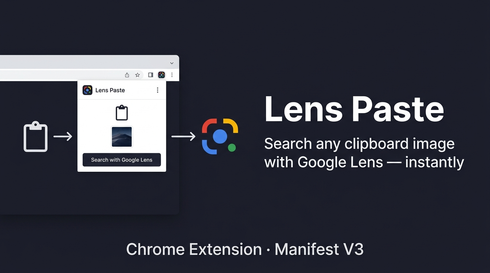

# Lens Paste

Upload a clipboard image directly to Google Lens — without saving it to disk first.

## What it does

Copy any image (screenshot, photo, diagram) to your clipboard, open the extension popup, and hit **Search with Google Lens**. The extension reads the clipboard image, compresses it, and submits it to Lens automatically.

No file-picking. No drag-and-drop. No downloads. Just Ctrl+C and click.

## How it works

Lens Paste uses the Chrome Clipboard API (`navigator.clipboard.read()`) to read the image directly from your clipboard. It compresses it as JPEG (85% quality) to speed up upload, stores it briefly in `chrome.storage.local`, then opens a bridge page (`upload.html`) that reconstructs a FormData multipart POST request — the same format Google Lens expects for direct image uploads.

The bridge page is opened in the current tab if it's a new tab page, or in a new tab otherwise.

## Key features

- Works with screenshots, screen captures, and any image from your clipboard
- Compresses images before upload for faster Lens response
- Handles the "Document not focused" timing issue on popup open with retry logic
- Zero saved files — the image never touches your file system
- Manifest V3 compliant

## Installation (Developer Mode)

1. Download or clone this repository
2. Open `chrome://extensions/`
3. Enable **Developer mode** (top right)
4. Click **Load unpacked**
5. Select the `Lens_Paste/` folder

## Usage

1. Copy any image to your clipboard (`PrtScn`, `Ctrl+C` on image, etc.)
2. Click the Lens Paste icon in your Chrome toolbar
3. Your clipboard image appears in the preview
4. Click **Search with Google Lens**

## Permissions

| Permission | Reason |
|---|---|
| `clipboardRead` | Read the image from clipboard |
| `tabs` | Open Lens in current or new tab |
| `storage` | Temporarily store the image blob |
| `declarativeNetRequest` | Modify headers for the Lens upload request |

## Tech

- Pure JavaScript, no frameworks
- Chrome Extension Manifest V3
- `navigator.clipboard.read()`, `canvas.toBlob()`, `FileReader`
- `chrome.storage.local`, `chrome.tabs`

## Limitations

- Only works on images in clipboard (not text)
- Requires clipboard permission consent on first use
- Google Lens must be accessible in your region

## Screenshots

## License

MIT
